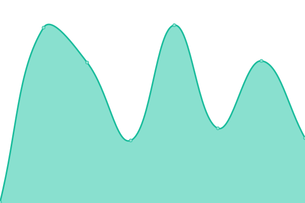
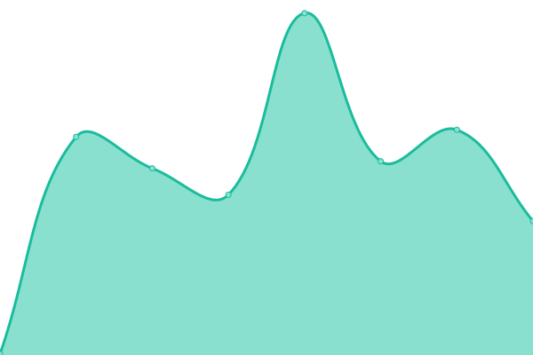

# [📈 Live Status](https://status.dineup.com): <!--live status--> **🟩 All systems operational**

This repository contains the open-source uptime monitor and status page for [DineUp](https://dineup.com), powered by [Upptime](https://github.com/upptime/upptime).

With [Upptime](https://upptime.js.org), you can get your own unlimited and free uptime monitor and status page, powered entirely by a GitHub repository. We use [Issues](https://github.com/DineUpGroup/status/issues) as incident reports, [Actions](https://github.com/DineUpGroup/status/actions) as uptime monitors, and [Pages](https://status.dineup.com) for the status page.

<!--start: status pages-->
<!-- This summary is generated by Upptime (https://github.com/upptime/upptime) -->
<!-- Do not edit this manually, your changes will be overwritten -->
<!-- prettier-ignore -->
| URL | Status | History | Response Time | Uptime |
| --- | ------ | ------- | ------------- | ------ |
|  [DineUp](https://app.dineup.com/api/ping) | 🟩 Up | [dine-up.yml](https://github.com/DineUpGroup/status/commits/HEAD/history/dine-up.yml) | 

 307ms
     
 | 

<a href="https://status.dineup.com/history/dine-up">100.00%</a>
    

|  [Test](https://test.dineup.com/api/ping) | 🟩 Up | [test.yml](https://github.com/DineUpGroup/status/commits/HEAD/history/test.yml) | 

 205ms
     
 | 

<a href="https://status.dineup.com/history/test">100.00%</a>
    

|  [Staging](https://staging.dineup.com/api/ping) | 🟩 Up | [staging.yml](https://github.com/DineUpGroup/status/commits/HEAD/history/staging.yml) | 

 222ms
     
 | 

<a href="https://status.dineup.com/history/staging">100.00%</a>
    

|  [Development](https://development.dineup.com/api/ping) | 🟩 Up | [development.yml](https://github.com/DineUpGroup/status/commits/HEAD/history/development.yml) | 

 196ms
     
 | 

<a href="https://status.dineup.com/history/development">100.00%</a>
    

|  [Website](https://dineup.com) | 🟩 Up | [website.yml](https://github.com/DineUpGroup/status/commits/HEAD/history/website.yml) | 

 101ms
     
 | 

<a href="https://status.dineup.com/history/website">100.00%</a>
    

|  [Retool](https://retool.dineup.com/api/checkHealth) | 🟩 Up | [retool.yml](https://github.com/DineUpGroup/status/commits/HEAD/history/retool.yml) | 

 382ms
     
 | 

<a href="https://status.dineup.com/history/retool">100.00%</a>
    

<!--end: status pages-->

[**Visit our status website →**](https://status.dineup.com)

## 📄 License

- Powered by: [Upptime](https://github.com/upptime/upptime)
- Code: [MIT](./LICENSE) © [DineUp](https://dineup.com)
- Data in the `./history` directory: [Open Database License](https://opendatacommons.org/licenses/odbl/1-0/)
